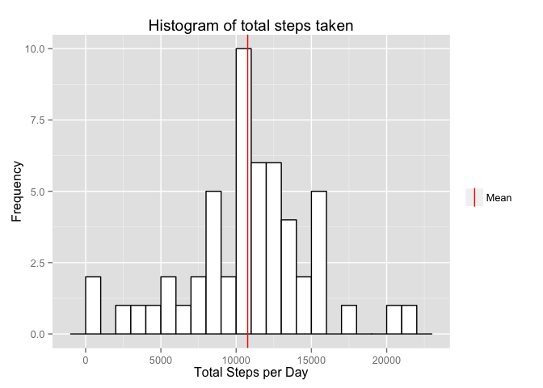
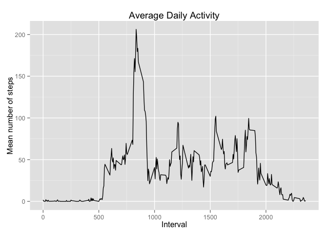
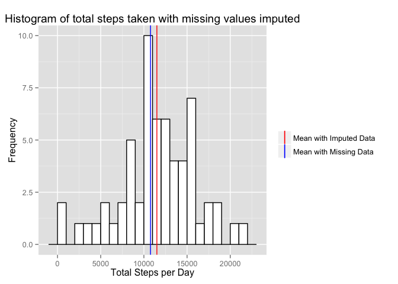
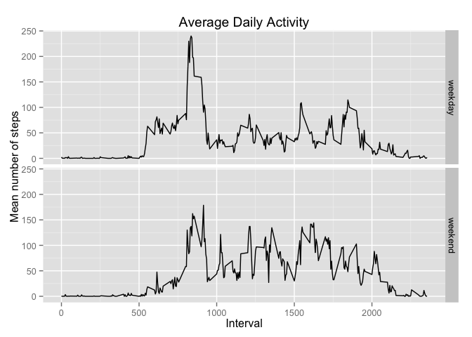

# Reproducible Research: Peer Assessment 1
Jason Giacomo  


# Loading and preprocessing the data

Begin by loading the data into a data frame (these commands assume the data has
been downloaded and extracted into the `data` directory, if not download the
file
[here](https://d396qusza40orc.cloudfront.net/repdata%2Fdata%2Factivity.zip). The
structure of the data is a csv file with 3 variables: steps, date, and interval
which are read into the data frame as integer, character, and 
integer types respectively.


```r
    # Load libraries for use in this document.
    library(readr)
    library(dplyr)
    library(ggplot2)
```

```r
    fitData <- read_csv("data/activity.csv", col_types = "ici")
    str(fitData)
```

```
## Classes 'tbl_df', 'tbl' and 'data.frame':	17568 obs. of  3 variables:
##  $ steps   : int  NA NA NA NA NA NA NA NA NA NA ...
##  $ date    : chr  "2012-10-01" "2012-10-01" "2012-10-01" "2012-10-01" ...
##  $ interval: int  0 5 10 15 20 25 30 35 40 45 ...
```

Each data row is the number of steps registered by the device on the specified
date during the specified 5 minute interval of the day.


```r
    summary(fitData$steps)
```

```
##    Min. 1st Qu.  Median    Mean 3rd Qu.    Max.    NA's 
##    0.00    0.00    0.00   37.38   12.00  806.00    2304
```

```r
    range(fitData$date)
```

```
## [1] "2012-10-01" "2012-11-30"
```

```r
    range(fitData$interval)
```

```
## [1]    0 2355
```

A quick look at the data indicates there are missing data for the number of
steps and the data span the period between 2012-10-01 and 
2012-11-30. The interval variable is a little strange in that it
records the minutes in the ones and tens digits and the hour in the hundreds and
thousands digits. However, this should not be a problem since this structure
keeps them properly sorted from earliest to latest.

# What is the mean total number of steps taken per day?

First, a look at the total number of steps per day:


```r
    spd <- fitData %>% group_by(date) %>% summarize(totalSteps = sum(steps))
    spdHist <- ggplot(spd, aes(x=totalSteps)) +
        geom_histogram(fill="white", color="black", binwidth=1000) +
        geom_vline(aes(xintercept=mean(spd$totalSteps, na.rm=TRUE),
                       color="Mean"),
                   show_guide = TRUE) +
        scale_colour_manual(name="", values=c(Mean="red")) +
        labs(x="Total Steps per Day", y="Frequency",
             title="Histogram of total steps taken")
    print(spdHist)
```

 

```r
    meanSteps <- as.integer(round(mean(spd$totalSteps, na.rm = TRUE),0))
    medianSteps <- as.integer(round(median(spd$totalSteps, na.rm = TRUE),0))
```

The mean number of steps taken per day is 10766
and the median is 10765.

# What is the average daily activity pattern?

The average daily activity will provide some information about the time of day
when the subject is most active. To look at this the mean steps over each
time interval is plotted.


```r
    ada <- fitData %>% group_by(interval) %>%
        summarize(avgSteps = mean(steps, na.rm=TRUE),
                  sdSteps = sd(steps, na.rm=TRUE))
    
    adaTimeseries <- ggplot(ada, aes(x=interval, y=avgSteps)) +
        geom_line() + labs(x="Interval", y="Mean number of steps", 
                           title="Average Daily Activity")
    print(adaTimeseries)
```

 

```r
    maxSteps <- max(ada$avgSteps)
    maxInterv <- ada[which(ada$avgSteps==maxSteps),]$interval
```

From the plot the maximum average number of steps taken, 206.1698113, occurs
during the 835 5-minute interval.

Not surprisingly the steps tend to peak just before the work day starts and just
after the workday ends with a small peak around lunch time.

# Imputing missing values

This data set has a number of missing values for the number of steps. While the
reason for these missing values is not obvious, the impact of the missing data
should be explored.


```r
    numMissing <- nrow(fitData[is.na(fitData$steps),])
    numMisPerc <- numMissing / nrow(fitData) * 100
```

There are 2304 missing step data, which is about
13% of the data. Assuming the number of steps in each time interval is normally distributed accross all days, the missing data will be imputed by randomly drawing from the time interval's distribution. This is accomplished by using `rnorm()` and setting the mean and standard deviation appropriately for the time interval. Also, make sure not to allow negative steps.


```r
    misData <- fitData %>% filter(is.na(steps))
    misData <- left_join(misData, ada)
```

```
## Joining by: "interval"
```

```r
    misData <- misData %>% select(-steps)
    impData <- left_join(fitData, misData, by=c("date","interval"))
    set.seed(5678)
    for(i in 1:nrow(impData)){
        if(is.na(impData[i,]$steps)) {
            impData[i,]$steps <- rnorm(1, mean=impData[i,]$avgSteps,
                                       sd=impData[i,]$sdSteps)
        }
        if(impData[i,]$steps < 0) {impData[i,]$steps <- 0}
    }
```

Now that the missing data has been imputed, the total number of steps taken each
day can be calculated and compared to the data with missing values.


```r
    impspd <- impData %>% group_by(date) %>% summarize(totalSteps = sum(steps))
    impspdHist <- ggplot(impspd, aes(x=totalSteps)) +
        geom_histogram(fill="white", color="black", binwidth=1000) +
        geom_vline(aes(xintercept=mean(impspd$totalSteps),
                       color="Mean with Imputed Data"),
                   show_guide=TRUE) +
        geom_vline(aes(xintercept=meanSteps, color="Mean with Missing Data"),
                   show_guide=TRUE) +
        scale_color_manual(name="", values=c("Mean with Imputed Data"="red",
                                             "Mean with Missing Data"="blue")) +
        labs(x="Total Steps per Day", y="Frequency",
             title="Histogram of total steps taken with missing values imputed")
    print(impspdHist)
```

 

```r
    impMeanSteps <- as.integer(round(mean(impspd$totalSteps, na.rm = TRUE),0))
    impMedianSteps <- as.integer(round(
                                 median(impspd$totalSteps, na.rm = TRUE),0)
                                 )
```

Now compare the mean and median with missing data and with imputed data:

Statistic | Missing Data    | Imputed Data
--------- | --------------- | ------------------
Mean      | 10766   | 11504
Median    | 10765 | 11458

From these results it appears that there is a significant change in the
averages when the missing data is imputed. This suggests that the data set is
not robust and the missing data should be filled in with real data or the
observations with missing data should be removed from the data set.

# Are there differences in activity patterns between weekdays and weekends?

A factor variable is created to indicate whether the data is from a weekday or a
weekend. Then, the data are plotted to compare between the weekdays and
weekends.


```r
    impData$day <- NA
    impData[grepl('Sat|Sun', weekdays(as.Date(impData$date))),]$day <-
        "weekend"
    impData[is.na(impData$day),]$day <- "weekday"
    impData$day <- as.factor(impData$day)
    
    dowDF <- impData %>% group_by(day, interval) %>%
        summarize(avgSteps = mean(steps))
    
    dowDFts <- ggplot(dowDF, aes(x=interval, y=avgSteps)) + geom_line() +
        labs(x="Interval", y="Mean number of steps",
             title="Average Daily Activity")
    facetPlot <- dowDFts + facet_grid(day ~ .)
    print(facetPlot)
```

 

From the plots it is clear that activity is more focused during the morning
hours on the weekdays and the activity is more spread out throughout the day on
the weekends.
